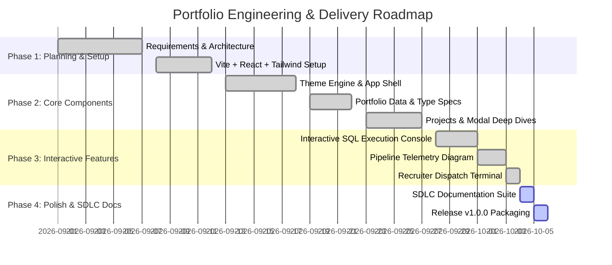

# Project Plan & Development Roadmap

| Document Version | 1.0.0 |
| :--- | :--- |
| **Project Title** | Arul // Technical Editorial & Engineering Portfolio |
| **Lifecycle Model** | Iterative Agile / Milestone-Driven Delivery |

---

## 1. Project Timeline & Milestones

---

## 2. Milestone Deliverables Breakdown

### Milestone 1: Foundation & Setup (Completed)
* Initialize Vite project with React 19, TypeScript, and TailwindCSS v4.
* Configure `@/` path alias mapping in `vite.config.ts`.
* Establish core type definitions in `src/types/portfolio.ts`.

### Milestone 2: UI Component Architecture (Completed)
* Build top navigation `Header.tsx` with theme selector.
* Develop `HeroSection.tsx` and `FoundationsSection.tsx` with role pill indicators.
* Build `ProjectsSection.tsx` with dynamic category filtering and dossier cards.
* Create `ProjectModal.tsx` and `ResumeModal.tsx`.

### Milestone 3: Interactive Demos & Terminals (Completed)
* Implement `SqlSandbox.tsx` supporting custom queries and execution latency presets.
* Implement `TelemetryDiagram.tsx` rendering interactive node topology for data pipelines.
* Implement `ContactSection.tsx` with live IST ticking clock and simulated TLS transmission output.

### Milestone 4: Documentation & SDLC Sign-off (Current Phase)
* Generate comprehensive SDLC markdown documentation across Planning, Architecture, Engineering, Testing, Operations, and User Guides.
* Prepare `README.md`, `CONTRIBUTING.md`, and `CHANGELOG.md`.

---

## 3. Future Enhancements & Version 2.0 Roadmap

| Feature Target | Target Release | Description | Priority |
| :--- | :--- | :--- | :--- |
| **Live WebAssembly SQL (DuckDB/sql.js)** | v1.1.0 | Replace simulated SQL execution with in-browser DuckDB WebAssembly engine allowing arbitrary SQL on local CSV datasets. | Medium |
| **Gemini AI Career Q&A Chatbot** | v1.2.0 | Integrate server-side Gemini API (`@google/genai`) to answer recruiter questions about Arul's experience in real-time. | High |
| **Real-Time Websocket Telemetry** | v1.3.0 | Stream live mock telemetry metrics via WebSockets into `TelemetryDiagram.tsx`. | Low |
| **Dark/Light Mode OS Auto-Detect** | v1.4.0 | Auto-sync default theme selection based on `prefers-color-scheme`. | Low |
