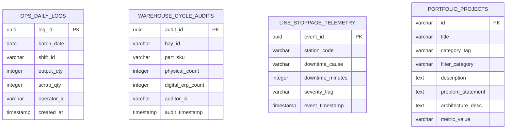

# Database Design & Schema Documentation

| Document Version | 1.0.0 |
| :--- | :--- |
| **Target Database Engine** | PostgreSQL 16 (Operational DW & Telemetry Store) |
| **Domain Context** | Manufacturing Operations, Cycle Audits, Machine Stoppage Telemetry |

---

## 1. Overview & Data Architecture

The **Arul Portfolio Application** showcases data engineering and analytics capabilities through simulated relational data models based on real-world manufacturing and telemetry workloads.

The primary database schema (`ops_production_dw`) models manufacturing batch logs, scrap rates, inventory cycle counts, and machine stoppage events.

---

## 2. Entity-Relationship Diagram (ERD)



---

## 3. Relational Table Schemas

### 3.1 Table: `ops_daily_logs`
Stores production volume, scrap output, and shift metadata for scrap rate optimization analytics.

```sql
CREATE TABLE ops_daily_logs (
    log_id UUID PRIMARY KEY DEFAULT gen_random_uuid(),
    batch_date DATE NOT NULL,
    shift_id VARCHAR(50) NOT NULL, -- e.g. 'SHIFT_A (Morning)', 'SHIFT_C (Night)'
    output_qty INTEGER NOT NULL CHECK (output_qty >= 0),
    scrap_qty INTEGER NOT NULL CHECK (scrap_qty >= 0),
    operator_id VARCHAR(50) NOT NULL,
    created_at TIMESTAMP WITH TIME ZONE DEFAULT CURRENT_TIMESTAMP
);

-- Indexing Strategy for Date & Shift Analytics
CREATE INDEX idx_ops_daily_logs_date_shift ON ops_daily_logs (batch_date DESC, shift_id);
```

### 3.2 Table: `warehouse_cycle_audits`
Tracks inventory variance between physical bay audits and digital ERP records.

```sql
CREATE TABLE warehouse_cycle_audits (
    audit_id UUID PRIMARY KEY DEFAULT gen_random_uuid(),
    bay_id VARCHAR(50) NOT NULL, -- e.g. 'BAY-12-NORTH'
    part_sku VARCHAR(100) NOT NULL, -- e.g. 'BEARING-6204-ZZ'
    physical_count INTEGER NOT NULL CHECK (physical_count >= 0),
    digital_erp_count INTEGER NOT NULL CHECK (digital_erp_count >= 0),
    variance_delta INTEGER GENERATED ALWAYS AS (physical_count - digital_erp_count) STORED,
    auditor_id VARCHAR(50) NOT NULL,
    audit_timestamp TIMESTAMP WITH TIME ZONE DEFAULT CURRENT_TIMESTAMP
);

-- Index for Filtering High Variance Items
CREATE INDEX idx_warehouse_audits_variance ON warehouse_cycle_audits (ABS(physical_count - digital_erp_count) DESC);
```

### 3.3 Table: `line_stoppage_telemetry`
Captures automated IoT telemetry events when manufacturing conveyor lines experience downtime.

```sql
CREATE TABLE line_stoppage_telemetry (
    event_id UUID PRIMARY KEY DEFAULT gen_random_uuid(),
    station_code VARCHAR(50) NOT NULL, -- e.g. 'CNC-MILL-02'
    downtime_cause VARCHAR(255) NOT NULL, -- e.g. 'Toolhead Calibration Drift'
    downtime_minutes INTEGER NOT NULL CHECK (downtime_minutes > 0),
    severity_flag VARCHAR(20) DEFAULT 'NORMAL',
    event_timestamp TIMESTAMP WITH TIME ZONE DEFAULT CURRENT_TIMESTAMP
);

-- Index for Station Stoppage Aggregations
CREATE INDEX idx_line_stoppage_station_cause ON line_stoppage_telemetry (station_code, downtime_cause);
```

---

## 4. Key Analytical Queries & Execution Patterns

### Query 1: Scrap Rate Percentage Calculation by Shift
Used in the portfolio's `SqlSandbox.tsx` preset:

```sql
SELECT shift_id, 
       SUM(scrap_qty) AS total_scrap, 
       SUM(output_qty) AS total_output, 
       ROUND((SUM(scrap_qty)::numeric / NULLIF(SUM(output_qty), 0)) * 100, 2) AS scrap_rate_pct
FROM ops_daily_logs 
WHERE batch_date >= CURRENT_DATE - INTERVAL '7 days'
GROUP BY shift_id 
ORDER BY scrap_rate_pct DESC;
```

### Query 2: Top Inventory Variance Delta Identification

```sql
SELECT bay_id, 
       part_sku, 
       physical_count, 
       digital_erp_count, 
       (physical_count - digital_erp_count) AS variance_delta
FROM warehouse_cycle_audits
WHERE ABS(physical_count - digital_erp_count) > 0
ORDER BY ABS(variance_delta) DESC
LIMIT 4;
```
