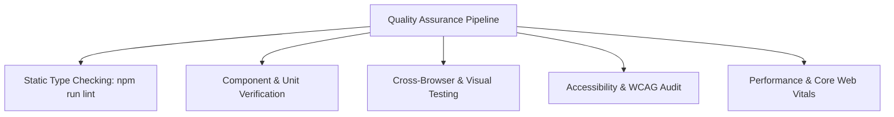

# Quality Assurance & Test Plan

| Document Version | 1.0.0 |
| :--- | :--- |
| **Strategy Purpose** | Define Quality Assurance Pillars, Test Environments, & Coverage Targets |
| **Testing Scope** | Unit, Component, E2E, Accessibility (a11y), Visual Regression |

---

## 1. QA Testing Strategy & Pillars

Our Quality Assurance methodology ensures high reliability, smooth user interaction, and zero runtime crashes across all supported devices and visual themes.

---

## 2. Testing Layers & Target Coverage

| Test Layer | Focus Area | Tooling | Coverage Target |
| :--- | :--- | :--- | :--- |
| **Static Verification** | Type-safety, missing props, syntax errors | TypeScript `tsc --noEmit` | 100% Files Checked |
| **Component Testing** | Render verification, state updates (themes, modals) | React Testing Library / Vitest | Key Interactive Widgets |
| **Accessibility (a11y)** | Keyboard traps, ARIA roles, color contrast | Chrome DevTools / Lighthouse | WCAG 2.1 AA Compliant |
| **Performance** | Load speed, LCP, INP, CLS | Lighthouse / Web Vitals | > 90 Performance Score |
| **Cross-Browser** | UI layout stability on Chrome, Firefox, Safari | Chrome DevTools / Manual | 100% Functional |

---

## 3. QA Environments & Testing Matrix

### Supported Viewports
1. **Desktop Large**: 1920 x 1080 (High-density dashboard view)
2. **Desktop Standard**: 1440 x 900
3. **Tablet**: 768 x 1024 (iPad vertical orientation)
4. **Mobile**: 375 x 812 (iPhone 13 / 14 portrait view)

### Theme Verification Matrix
* `Cobalt Theme`: Check slate/blue background, contrast ratios on white cards.
* `Rust Theme`: Check terra cotta highlights, dark text readability on warm paper background.
* `Obsidian Theme`: Verify dark mode root synchronization (`#0f1013`), card border visibility, and high contrast terminal text.

---

## 4. Defect Severity Triage Classification

| Severity Level | Criteria | SLA Resolution |
| :--- | :--- | :--- |
| **Blocker (P0)** | Application crash, white screen of death, unhandled JavaScript exception. | Immediate / Within 2 hours |
| **Critical (P1)** | Modal closer unresponsive, SQL sandbox frozen, broken recruiter submission form. | Within 24 hours |
| **Major (P2)** | Theme flicker during toggle, typography misalignment on mobile viewports. | Within 48 hours |
| **Minor (P3)** | Spacing inconsistency, non-critical typo in project description. | Next Sprint |
