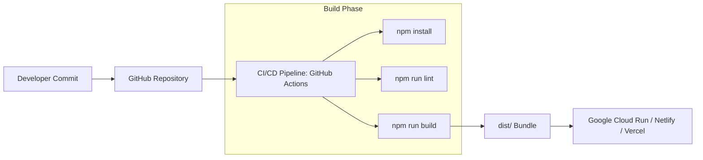

# Deployment Runbook & Operational Procedures

| Document Version | 1.0.0 |
| :--- | :--- |
| **Deployment Model** | Static Web Build / Cloud Run / Vercel / Netlify / GitHub Pages |
| **Build System** | Vite 8.3 |

---

## 1. Overview & Build Pipeline Architecture

The application compiles into static HTML, JavaScript, and CSS bundles that can be deployed to any modern edge hosting infrastructure or containerized environment.



---

## 2. Production Build Execution

To generate production-ready static assets locally or in a CI pipeline:

```bash
# 1. Clean previous build artifacts
npm run clean

# 2. Execute TypeScript type validation
npm run lint

# 3. Trigger Vite production compilation
npm run build
```

The output assets will be generated in the `dist/` directory:
```
dist/
├── index.html                  # Minified single page entry point
├── assets/
│   ├── index-Db9aX21.js        # Minified ESM application bundle
│   └── index-C4xL9zP.css       # Optimized TailwindCSS v4 stylesheet
```

---

## 3. Deployment Provider Guides

### Option 1: Google Cloud Run Deployment
If containerizing the application for Google Cloud Run (as noted in `.env.example` `APP_URL` settings):

1. **Create Dockerfile** in root directory:
   ```dockerfile
   FROM node:20-alpine AS builder
   WORKDIR /app
   COPY package*.json ./
   RUN npm install
   COPY . .
   RUN npm run build

   FROM nginx:alpine
   COPY --from=builder /app/dist /usr/share/nginx/html
   EXPOSE 80
   CMD ["nginx", "-g", "daemon off;"]
   ```

2. **Build & Deploy Image**:
   ```bash
   gcloud builds submit --tag gcr.io/your-project/arul-portfolio
   gcloud run deploy arul-portfolio \
     --image gcr.io/your-project/arul-portfolio \
     --platform managed \
     --region us-central1 \
     --allow-unauthenticated
   ```

### Option 2: Vercel / Netlify Static Hosting
* **Build Command**: `npm run build`
* **Output Directory**: `dist`
* **Node Version**: `20.x`

---

## 4. Rollback & Failover Procedures

If a newly deployed release exhibits runtime anomalies:

1. **Vercel / Netlify**: Access Deployment Dashboard -> Select previous stable deployment (`v0.9.9`) -> Click **Promote to Production**.
2. **Google Cloud Run**: Route 100% of traffic back to previous revision:
   ```bash
   gcloud run services update-traffic arul-portfolio --to-revisions=arul-portfolio-00001-abc=100
   ```
